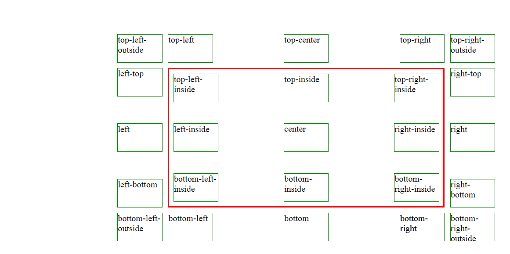

# Positionizer

Set relative position to element from a referentiel element

 

    
    
    
    
    
    
    
    
      
    
    
    
  

 

 
The lastest version of this document is available on [Github > positionizer](https://github.com/Sylvain59650/positionizer/blob/master/README.md)

## Installation
<code>

    npm install positionizer --save

OR

    yarn add positionizer --save
</code>

## Reference in browser

    

## usage

    Positionizer.setRelativePosition(refElement, floatingElement, placement, appendToBody, distX, distY);

where:

    refElement: the fixed element
    floatingElement: the element to be placed in relation to the reference element
    placement: relative position
        like :

            bottom-right
            bottom-left
            bottom
            top-right
            right-bottom
            bottom-right
            left-bottom
            left-top
            top-left
            top-center
            right
            left
            right-top
            top-right-outside
            top-left-outside
            bottom-left-outside
            bottom-right-outside
            bottom-right-inside
            bottom-left-inside
            bottom-inside
            top-right-inside
            top-left-inside
            top-inside
            left-inside
            right-inside

    appendToBody: boolean
    distX : horizontal distance between the 2 elements, default is 0.
    distY : vertical distance between the 2 elements, default is 0.

<a href="https://sylvain59650.github.io/positionizer/">API & Demo</a>